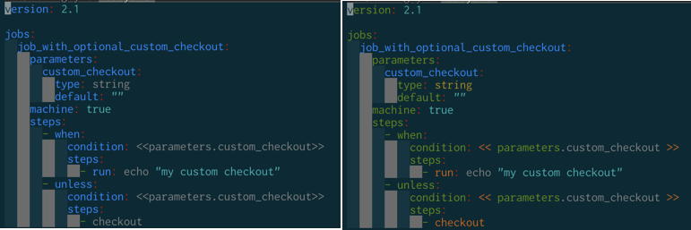

# vim-circleci

Support for [CircleCI](https://circleci.com/) Config YAML.

This plugin provides following for `config.yaml`

- Highlighting
- Completion

TODO: I'll add some snippets

## Highlighting Example


before <-> after


# Installation

## dein.vim

```vim
call dein#add('yasuhiroki/circleci.vim')
```

## Options

- `g:circleci_omnifunc_enable`
  - if value is 1 set omnifunc=circleci#Complete
  - default: 0

## License

[MIT License](License.txt)
